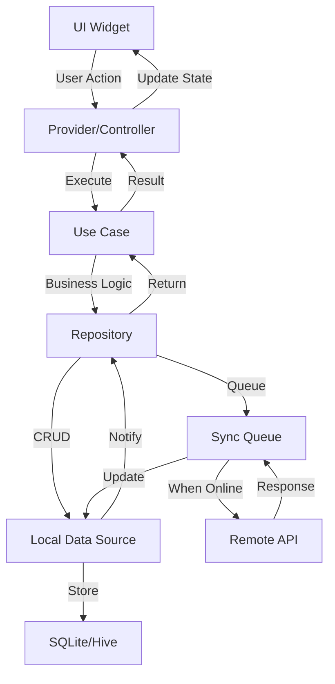

# System Design Document
# GoDial - Offline-First Flutter Application

**Version**: 1.0
**Date**: November 13, 2024
**Architecture Type**: Offline-First, Event-Driven, Clean Architecture
**Technology Stack**: Flutter, SQLite, Hive, Drift, Riverpod

---

## Table of Contents
1. [Executive Summary](#1-executive-summary)
2. [System Overview](#2-system-overview)
3. [Architecture Principles](#3-architecture-principles)
4. [Technology Stack](#4-technology-stack)
5. [System Architecture](#5-system-architecture)
6. [Data Architecture](#6-data-architecture)
7. [Offline-First Design](#7-offline-first-design)
8. [Component Design](#8-component-design)
9. [Feature Implementation](#9-feature-implementation)
10. [Security Architecture](#10-security-architecture)
11. [Performance Optimization](#11-performance-optimization)
12. [Testing Strategy](#12-testing-strategy)
13. [Deployment Architecture](#13-deployment-architecture)
14. [Monitoring & Analytics](#14-monitoring-analytics)
15. [Appendices](#15-appendices)

---

## 1. Executive Summary

### 1.1 Document Purpose
This document provides the complete system design for GoDial, a fully offline-capable CRM and auto-dialer application built with Flutter. The design prioritizes offline functionality, ensuring all features work without internet connectivity while maintaining data integrity and synchronization capabilities.

### 1.2 Key Design Goals
- **100% Offline Functionality**: Every feature must work without internet
- **Data Integrity**: Zero data loss, even during sync conflicts
- **Performance**: Sub-second response times for all operations
- **Scalability**: Support 10,000+ contacts per device
- **Security**: End-to-end encryption for sensitive data
- **Cross-Platform**: Single codebase for iOS and Android

### 1.3 Constraints
- App size must be under 50MB
- Must run on devices with 2GB RAM
- Support Android 7.0+ and iOS 12.0+
- Battery consumption < 5% per hour of active use
- Storage usage < 500MB for 10,000 contacts

---

## 2. System Overview

### 2.1 High-Level Architecture

```
┌─────────────────────────────────────────────────────────┐
│                    Flutter Application                   │
├─────────────────────────────────────────────────────────┤
│                  Presentation Layer                      │
│         (Screens, Widgets, State Management)            │
├─────────────────────────────────────────────────────────┤
│                    Domain Layer                          │
│         (Business Logic, Use Cases, Entities)           │
├─────────────────────────────────────────────────────────┤
│                     Data Layer                           │
│    (Repositories, Data Sources, Models, Mappers)        │
├─────────────────────────────────────────────────────────┤
│                 Local Storage Layer                      │
│        (SQLite, Hive, Shared Preferences, Files)        │
├─────────────────────────────────────────────────────────┤
│                  Sync Engine Layer                       │
│    (Queue Manager, Conflict Resolution, Sync Logic)     │
├─────────────────────────────────────────────────────────┤
│                Platform Services Layer                   │
│    (Telephony, Contacts, Permissions, Notifications)    │
└─────────────────────────────────────────────────────────┘
```

### 2.2 Core Components

1. **Offline Storage Engine**: SQLite + Drift for relational data
2. **Sync Engine**: Background sync with conflict resolution
3. **Queue System**: Persistent action queue for offline operations
4. **State Management**: Riverpod for reactive state management
5. **Navigation**: Go Router for declarative routing
6. **Platform Channels**: Native integration for calls and SMS

---

## 3. Architecture Principles

### 3.1 Offline-First Principles
1. **Local-First Data**: All data stored locally, sync is secondary
2. **Optimistic Updates**: Immediate UI updates, background sync
3. **Queue-Based Sync**: All actions queued and processed when online
4. **Conflict Resolution**: Last-write-wins with manual override
5. **Incremental Sync**: Only changed data synchronized
6. **Resilient Operations**: Graceful handling of connectivity changes

### 3.2 Clean Architecture Principles
1. **Separation of Concerns**: Clear layer boundaries
2. **Dependency Injection**: Loose coupling between components
3. **Single Responsibility**: Each class has one reason to change
4. **Interface Segregation**: Clients depend only on what they need
5. **Dependency Inversion**: Depend on abstractions, not concretions

### 3.3 Flutter Best Practices
1. **Widget Composition**: Small, reusable widgets
2. **Immutable State**: All state objects are immutable
3. **Reactive Programming**: Stream-based data flow
4. **Platform Adaptation**: iOS and Android specific UI
5. **Performance First**: Const constructors, lazy loading

---

## 4. Technology Stack

### 4.1 Core Technologies

#### Frontend Framework
```yaml
flutter:
  sdk: ">=3.16.0 <4.0.0"

dependencies:
  # State Management
  flutter_riverpod: ^2.4.0
  riverpod_annotation: ^2.3.0

  # Navigation
  go_router: ^12.0.0

  # UI Components
  flutter_native_splash: ^2.3.5
  animations: ^2.0.8
```

#### Local Storage
```yaml
dependencies:
  # Relational Database
  sqflite: ^2.3.0
  drift: ^2.13.0
  sqlite3_flutter_libs: ^0.5.18

  # Key-Value Storage
  hive: ^2.2.3
  hive_flutter: ^1.1.0

  # Secure Storage
  flutter_secure_storage: ^9.0.0

  # File Storage
  path_provider: ^2.1.1
  path: ^1.8.3
```

#### Data Processing
```yaml
dependencies:
  # Serialization
  json_annotation: ^4.8.1
  freezed_annotation: ^2.4.1

  # Data Manipulation
  collection: ^1.18.0
  equatable: ^2.0.5
  uuid: ^4.2.1
```

#### Communication
```yaml
dependencies:
  # HTTP (for sync when online)
  dio: ^5.3.4
  retrofit: ^4.0.3

  # Platform Channels
  flutter_phone_direct_caller: ^2.1.1
  telephony: ^0.2.0
  permission_handler: ^11.0.1
```

### 4.2 Development Tools
```yaml
dev_dependencies:
  # Code Generation
  build_runner: ^2.4.6
  drift_dev: ^2.13.0
  freezed: ^2.4.5
  json_serializable: ^6.7.1
  riverpod_generator: ^2.3.0

  # Testing
  flutter_test:
    sdk: flutter
  mockito: ^5.4.3
  flutter_driver:
    sdk: flutter
  integration_test:
    sdk: flutter

  # Linting
  flutter_lints: ^3.0.1
```

---

## 5. System Architecture

### 5.1 Layered Architecture

#### 5.1.1 Presentation Layer
```dart
// Structure
lib/
├── presentation/
│   ├── screens/
│   │   ├── contacts/
│   │   │   ├── contacts_screen.dart
│   │   │   ├── contact_detail_screen.dart
│   │   │   └── widgets/
│   │   ├── dialer/
│   │   ├── pipeline/
│   │   └── settings/
│   ├── widgets/
│   │   ├── common/
│   │   └── animations/
│   └── providers/
│       ├── contact_provider.dart
│       └── app_state_provider.dart
```

#### 5.1.2 Domain Layer
```dart
// Structure
lib/
├── domain/
│   ├── entities/
│   │   ├── contact.dart
│   │   ├── call_log.dart
│   │   └── task.dart
│   ├── repositories/
│   │   ├── contact_repository.dart
│   │   └── sync_repository.dart
│   ├── usecases/
│   │   ├── get_contacts_usecase.dart
│   │   ├── sync_data_usecase.dart
│   │   └── make_call_usecase.dart
│   └── services/
│       ├── dialer_service.dart
│       └── notification_service.dart
```

#### 5.1.3 Data Layer
```dart
// Structure
lib/
├── data/
│   ├── models/
│   │   ├── contact_model.dart
│   │   └── sync_model.dart
│   ├── datasources/
│   │   ├── local/
│   │   │   ├── database.dart
│   │   │   └── dao/
│   │   └── remote/
│   │       └── api_client.dart
│   ├── repositories/
│   │   └── contact_repository_impl.dart
│   └── mappers/
│       └── contact_mapper.dart
```

### 5.2 Component Interaction Flow



---

## 6. Data Architecture

### 6.1 Database Schema

#### 6.1.1 Core Tables Structure

```sql
-- Users Table
CREATE TABLE users (
    id TEXT PRIMARY KEY,
    email TEXT UNIQUE,
    phone TEXT,
    name TEXT,
    organization_name TEXT,
    subscription_type TEXT,
    created_at INTEGER,
    updated_at INTEGER,
    sync_status INTEGER DEFAULT 0
);

-- Contacts Table
CREATE TABLE contacts (
    id TEXT PRIMARY KEY,
    user_id TEXT,
    first_name TEXT,
    last_name TEXT,
    phone_primary TEXT,
    phone_secondary TEXT,
    email TEXT,
    company TEXT,
    designation TEXT,
    address TEXT,
    dob TEXT,
    lead_score INTEGER DEFAULT 0,
    stage_id TEXT,
    tags TEXT, -- JSON array
    custom_fields TEXT, -- JSON object
    created_at INTEGER,
    updated_at INTEGER,
    deleted_at INTEGER,
    sync_status INTEGER DEFAULT 0,
    version INTEGER DEFAULT 1,
    FOREIGN KEY (user_id) REFERENCES users(id)
);

-- Indexes for performance
CREATE INDEX idx_contacts_user_id ON contacts(user_id);
CREATE INDEX idx_contacts_phone ON contacts(phone_primary);
CREATE INDEX idx_contacts_lead_score ON contacts(lead_score);
CREATE INDEX idx_contacts_sync_status ON contacts(sync_status);

-- Call Logs Table
CREATE TABLE call_logs (
    id TEXT PRIMARY KEY,
    contact_id TEXT,
    phone_number TEXT,
    direction TEXT, -- incoming/outgoing
    duration INTEGER, -- seconds
    status TEXT, -- answered/missed/rejected
    notes TEXT,
    recording_path TEXT,
    created_at INTEGER,
    sync_status INTEGER DEFAULT 0,
    FOREIGN KEY (contact_id) REFERENCES contacts(id)
);

-- Tasks Table
CREATE TABLE tasks (
    id TEXT PRIMARY KEY,
    contact_id TEXT,
    title TEXT,
    description TEXT,
    due_date INTEGER,
    status TEXT, -- pending/completed/cancelled
    priority INTEGER, -- 1-5
    reminder_time INTEGER,
    recurring_pattern TEXT, -- JSON
    created_at INTEGER,
    updated_at INTEGER,
    completed_at INTEGER,
    sync_status INTEGER DEFAULT 0,
    FOREIGN KEY (contact_id) REFERENCES contacts(id)
);

-- Pipeline Stages Table
CREATE TABLE pipeline_stages (
    id TEXT PRIMARY KEY,
    name TEXT,
    color TEXT,
    order_index INTEGER,
    probability INTEGER,
    created_at INTEGER,
    sync_status INTEGER DEFAULT 0
);

-- Deals Table
CREATE TABLE deals (
    id TEXT PRIMARY KEY,
    contact_id TEXT,
    stage_id TEXT,
    title TEXT,
    value REAL,
    currency TEXT,
    expected_close_date INTEGER,
    status TEXT, -- open/won/lost
    notes TEXT,
    created_at INTEGER,
    updated_at INTEGER,
    closed_at INTEGER,
    sync_status INTEGER DEFAULT 0,
    FOREIGN KEY (contact_id) REFERENCES contacts(id),
    FOREIGN KEY (stage_id) REFERENCES pipeline_stages(id)
);

-- Sync Queue Table
CREATE TABLE sync_queue (
    id INTEGER PRIMARY KEY AUTOINCREMENT,
    entity_type TEXT, -- contact/task/deal/etc
    entity_id TEXT,
    action TEXT, -- create/update/delete
    payload TEXT, -- JSON data
    priority INTEGER DEFAULT 5,
    retry_count INTEGER DEFAULT 0,
    max_retries INTEGER DEFAULT 3,
    status TEXT DEFAULT 'pending', -- pending/processing/completed/failed
    error_message TEXT,
    created_at INTEGER,
    processed_at INTEGER
);

-- Conflict Resolution Table
CREATE TABLE conflicts (
    id TEXT PRIMARY KEY,
    entity_type TEXT,
    entity_id TEXT,
    local_data TEXT, -- JSON
    remote_data TEXT, -- JSON
    resolution_status TEXT, -- pending/local_wins/remote_wins/merged
    resolved_at INTEGER,
    created_at INTEGER
);
```

### 6.2 Data Models Implementation

#### 6.2.1 Contact Model
```dart
@freezed
class Contact with _$Contact {
  const factory Contact({
    required String id,
    required String userId,
    String? firstName,
    String? lastName,
    required String phonePrimary,
    String? phoneSecondary,
    String? email,
    String? company,
    String? designation,
    String? address,
    DateTime? dob,
    @Default(0) int leadScore,
    String? stageId,
    @Default([]) List<String> tags,
    @Default({}) Map<String, dynamic> customFields,
    required DateTime createdAt,
    required DateTime updatedAt,
    DateTime? deletedAt,
    @Default(SyncStatus.pending) SyncStatus syncStatus,
    @Default(1) int version,
  }) = _Contact;

  factory Contact.fromJson(Map<String, dynamic> json) => _$ContactFromJson(json);
}

enum SyncStatus {
  pending,
  synced,
  modified,
  conflict,
  error
}
```

#### 6.2.2 Database Helper Implementation
```dart
@DriftDatabase(tables: [Contacts, CallLogs, Tasks, SyncQueue])
class AppDatabase extends _$AppDatabase {
  AppDatabase() : super(_openConnection());

  @override
  int get schemaVersion => 1;

  static LazyDatabase _openConnection() {
    return LazyDatabase(() async {
      final dbFolder = await getApplicationDocumentsDirectory();
      final file = File(p.join(dbFolder.path, 'godial.db'));

      // Encrypt database for security
      return NativeDatabase.createInBackground(
        file,
        setup: (database) {
          database.execute('PRAGMA key = "encryption_key_here"');
        },
      );
    });
  }

  // Contact Operations
  Future<List<Contact>> getAllContacts() => select(contacts).get();

  Future<Contact?> getContact(String id) =>
      (select(contacts)..where((c) => c.id.equals(id))).getSingleOrNull();

  Future<int> insertContact(ContactsCompanion contact) =>
      into(contacts).insert(contact);

  Future<bool> updateContact(Contact contact) =>
      update(contacts).replace(contact);

  Future<int> deleteContact(String id) =>
      (delete(contacts)..where((c) => c.id.equals(id))).go();

  // Sync Queue Operations
  Future<void> addToSyncQueue(SyncQueueData item) =>
      into(syncQueue).insert(item);

  Stream<List<SyncQueueData>> watchPendingSyncItems() =>
      (select(syncQueue)
        ..where((q) => q.status.equals('pending'))
        ..orderBy([(q) => OrderingTerm.asc(q.priority)]))
      .watch();
}
```

### 6.3 Offline Storage Strategy

#### 6.3.1 Storage Allocation
```dart
class StorageManager {
  static const Map<String, int> STORAGE_LIMITS = {
    'contacts': 10000,      // Max contacts
    'call_logs': 50000,     // Max call logs
    'tasks': 5000,          // Max tasks
    'attachments': 100,     // Max MB for attachments
    'cache': 50,            // Max MB for cache
  };

  Future<StorageInfo> getStorageInfo() async {
    final dbSize = await _calculateDatabaseSize();
    final cacheSize = await _calculateCacheSize();
    final attachmentSize = await _calculateAttachmentSize();

    return StorageInfo(
      totalUsed: dbSize + cacheSize + attachmentSize,
      databaseSize: dbSize,
      cacheSize: cacheSize,
      attachmentSize: attachmentSize,
      availableSpace: await _getAvailableSpace(),
    );
  }

  Future<void> cleanupIfNeeded() async {
    final info = await getStorageInfo();

    if (info.totalUsed > STORAGE_LIMITS['total']!) {
      // Remove old call logs
      await _removeOldCallLogs();
      // Clear cache
      await _clearCache();
      // Compress attachments
      await _compressAttachments();
    }
  }
}
```

---

## 7. Offline-First Design

### 7.1 Sync Engine Architecture

#### 7.1.1 Sync Manager Implementation
```dart
class SyncManager {
  final AppDatabase _database;
  final ApiClient _apiClient;
  final ConnectivityService _connectivity;
  final ConflictResolver _conflictResolver;

  StreamSubscription? _connectivitySubscription;
  Timer? _syncTimer;
  bool _isSyncing = false;

  void initialize() {
    // Listen for connectivity changes
    _connectivitySubscription = _connectivity.onConnectivityChanged
        .listen((hasConnection) {
      if (hasConnection && !_isSyncing) {
        startSync();
      }
    });

    // Schedule periodic sync every 5 minutes
    _syncTimer = Timer.periodic(Duration(minutes: 5), (_) {
      if (_connectivity.hasConnection && !_isSyncing) {
        startSync();
      }
    });
  }

  Future<void> startSync() async {
    if (_isSyncing) return;
    _isSyncing = true;

    try {
      // 1. Process sync queue
      await _processSyncQueue();

      // 2. Pull changes from server
      await _pullChanges();

      // 3. Resolve conflicts
      await _resolveConflicts();

      // 4. Update sync status
      await _updateSyncStatus();

    } catch (e) {
      _handleSyncError(e);
    } finally {
      _isSyncing = false;
    }
  }

  Future<void> _processSyncQueue() async {
    final items = await _database.getPendingSyncItems();

    for (final item in items) {
      try {
        switch (item.action) {
          case 'create':
            await _syncCreate(item);
            break;
          case 'update':
            await _syncUpdate(item);
            break;
          case 'delete':
            await _syncDelete(item);
            break;
        }

        await _database.markSyncComplete(item.id);
      } catch (e) {
        await _handleItemSyncError(item, e);
      }
    }
  }

  Future<void> _pullChanges() async {
    final lastSync = await _getLastSyncTime();
    final changes = await _apiClient.getChanges(since: lastSync);

    for (final change in changes) {
      await _applyRemoteChange(change);
    }

    await _saveLastSyncTime(DateTime.now());
  }
}
```

#### 7.1.2 Conflict Resolution Strategy
```dart
class ConflictResolver {
  Future<ResolvedData> resolve(
    LocalData local,
    RemoteData remote,
  ) async {
    // Compare timestamps
    if (local.updatedAt.isAfter(remote.updatedAt)) {
      return ResolvedData.fromLocal(local);
    }

    // Check version numbers
    if (local.version > remote.version) {
      return ResolvedData.fromLocal(local);
    }

    // Field-level merge for contacts
    if (local is Contact && remote is Contact) {
      return _mergeContacts(local, remote);
    }

    // Default: Remote wins
    return ResolvedData.fromRemote(remote);
  }

  ResolvedData _mergeContacts(Contact local, Contact remote) {
    return ResolvedData(
      data: Contact(
        id: local.id,
        // Take newer phone number
        phonePrimary: local.phonePrimary != remote.phonePrimary
            ? (local.updatedAt.isAfter(remote.updatedAt)
                ? local.phonePrimary
                : remote.phonePrimary)
            : local.phonePrimary,
        // Merge tags
        tags: {...local.tags, ...remote.tags}.toList(),
        // Take higher lead score
        leadScore: max(local.leadScore, remote.leadScore),
        // Latest update time
        updatedAt: local.updatedAt.isAfter(remote.updatedAt)
            ? local.updatedAt
            : remote.updatedAt,
        // Increment version
        version: max(local.version, remote.version) + 1,
      ),
      conflictResolution: ConflictResolution.merged,
    );
  }
}
```

### 7.2 Queue System Implementation

#### 7.2.1 Action Queue Manager
```dart
class ActionQueueManager {
  final AppDatabase _database;
  final Queue<QueueItem> _memoryQueue = Queue();
  StreamController<QueueStatus> _statusController = StreamController.broadcast();

  Future<void> enqueue(QueueItem item) async {
    // Add to memory queue for immediate processing
    _memoryQueue.add(item);

    // Persist to database
    await _database.addToQueue(item);

    // Notify listeners
    _statusController.add(QueueStatus(
      pending: _memoryQueue.length,
      processing: 0,
    ));

    // Try to process immediately if online
    _processQueue();
  }

  Future<void> _processQueue() async {
    while (_memoryQueue.isNotEmpty) {
      final item = _memoryQueue.removeFirst();

      try {
        await _processItem(item);
        await _database.removeFromQueue(item.id);
      } catch (e) {
        // Re-add to queue with retry logic
        item.retryCount++;
        if (item.retryCount < item.maxRetries) {
          _memoryQueue.add(item);
          // Exponential backoff
          await Future.delayed(
            Duration(seconds: pow(2, item.retryCount).toInt()),
          );
        } else {
          await _database.markQueueItemFailed(item.id, e.toString());
        }
      }
    }
  }
}
```

### 7.3 Offline Capabilities Map

| Feature | Offline Support | Sync Strategy | Conflict Resolution |
|---------|----------------|---------------|-------------------|
| Contact Creation | ✅ Full | Queue-based | Last-write-wins |
| Contact Update | ✅ Full | Differential | Field-level merge |
| Contact Delete | ✅ Full | Soft delete | Restore option |
| Make Calls | ✅ Full | Log & sync | Append-only |
| Send SMS | ✅ Queue | Retry queue | No conflict |
| WhatsApp | ✅ Queue | Retry queue | No conflict |
| Task Creation | ✅ Full | Queue-based | Last-write-wins |
| Pipeline Update | ✅ Full | Version control | Manual resolution |
| Reports | ✅ Local data | Incremental | N/A |
| Settings | ✅ Full | Last-write | Device-specific |

---

## 8. Component Design

### 8.1 Core Components

#### 8.1.1 Contact Manager Component
```dart
class ContactManager extends ChangeNotifier {
  final AppDatabase _database;
  final SyncManager _syncManager;
  final ContactValidator _validator;

  List<Contact> _contacts = [];
  ContactFilter _filter = ContactFilter.all();
  ContactSort _sort = ContactSort.byName();

  Future<void> loadContacts() async {
    _contacts = await _database.getContacts(_filter, _sort);
    notifyListeners();
  }

  Future<Either<Failure, Contact>> createContact(ContactInput input) async {
    // Validate input
    final validation = _validator.validate(input);
    if (validation.isLeft()) {
      return Left(validation.left);
    }

    // Create contact with unique ID
    final contact = Contact(
      id: Uuid().v4(),
      ...input.toContact(),
      createdAt: DateTime.now(),
      updatedAt: DateTime.now(),
      syncStatus: SyncStatus.pending,
    );

    // Save to database
    await _database.insertContact(contact);

    // Add to sync queue
    await _syncManager.queueAction(
      SyncAction.create(
        entityType: 'contact',
        entityId: contact.id,
        data: contact.toJson(),
      ),
    );

    // Update local list
    _contacts.add(contact);
    notifyListeners();

    return Right(contact);
  }

  Future<void> importContacts(File file) async {
    final importer = ContactImporter();
    final contacts = await importer.import(file);

    // Batch insert with duplicate detection
    final batch = _database.batch();
    for (final contact in contacts) {
      if (!_isDuplicate(contact)) {
        batch.insert(contact);
      }
    }
    await batch.commit();

    // Reload contacts
    await loadContacts();
  }
}
```

#### 8.1.2 Dialer Component
```dart
class DialerService {
  final TelephonyService _telephony;
  final CallLogger _callLogger;
  final ContactManager _contactManager;
  final Queue<String> _dialQueue = Queue();

  bool _isDialing = false;
  Timer? _autoDialTimer;
  StreamController<DialerState> _stateController = StreamController.broadcast();

  Future<void> makeCall(String phoneNumber) async {
    try {
      // Request permission if needed
      await _requestCallPermission();

      // Start call
      await _telephony.makeCall(phoneNumber);

      // Log call initiation
      final callLog = CallLog(
        id: Uuid().v4(),
        phoneNumber: phoneNumber,
        direction: CallDirection.outgoing,
        startTime: DateTime.now(),
        status: CallStatus.initiated,
      );

      await _callLogger.logCall(callLog);

      // Listen for call state changes
      _telephony.onCallStateChanged.listen((state) {
        _handleCallStateChange(state, callLog);
      });

    } catch (e) {
      _handleCallError(e);
    }
  }

  Future<void> startAutoDialer(List<Contact> contacts) async {
    if (_isDialing) return;

    _isDialing = true;
    _dialQueue.addAll(contacts.map((c) => c.phonePrimary));

    _autoDialTimer = Timer.periodic(
      Duration(seconds: _getDialerDelay()),
      (_) => _processDialQueue(),
    );

    _stateController.add(DialerState.running(
      total: contacts.length,
      remaining: _dialQueue.length,
    ));
  }

  Future<void> _processDialQueue() async {
    if (_dialQueue.isEmpty) {
      stopAutoDialer();
      return;
    }

    final phoneNumber = _dialQueue.removeFirst();
    await makeCall(phoneNumber);

    _stateController.add(DialerState.running(
      total: _dialQueue.length + 1,
      remaining: _dialQueue.length,
    ));
  }
}
```

#### 8.1.3 Task Management Component
```dart
class TaskManager {
  final AppDatabase _database;
  final NotificationService _notifications;
  final TaskScheduler _scheduler;

  Future<Task> createTask(TaskInput input) async {
    final task = Task(
      id: Uuid().v4(),
      title: input.title,
      description: input.description,
      dueDate: input.dueDate,
      priority: input.priority,
      status: TaskStatus.pending,
      createdAt: DateTime.now(),
      syncStatus: SyncStatus.pending,
    );

    // Save to database
    await _database.insertTask(task);

    // Schedule reminder if needed
    if (input.reminderTime != null) {
      await _scheduler.scheduleReminder(
        task.id,
        input.reminderTime!,
        task.title,
      );
    }

    // Setup recurring tasks
    if (input.recurringPattern != null) {
      await _setupRecurring(task, input.recurringPattern!);
    }

    return task;
  }

  Future<void> _setupRecurring(Task task, RecurringPattern pattern) async {
    final nextDates = pattern.getNextOccurrences(10);

    for (final date in nextDates) {
      final recurringTask = task.copyWith(
        id: Uuid().v4(),
        dueDate: date,
        parentTaskId: task.id,
      );

      await _database.insertTask(recurringTask);
    }
  }

  Stream<List<Task>> watchTodaysTasks() {
    final today = DateTime.now();
    final startOfDay = DateTime(today.year, today.month, today.day);
    final endOfDay = startOfDay.add(Duration(days: 1));

    return _database.watchTasksBetween(startOfDay, endOfDay);
  }
}
```

### 8.2 UI Components

#### 8.2.1 Responsive Layout System
```dart
class ResponsiveBuilder extends StatelessWidget {
  final Widget Function(BuildContext, DeviceType) builder;

  const ResponsiveBuilder({required this.builder});

  @override
  Widget build(BuildContext context) {
    return LayoutBuilder(
      builder: (context, constraints) {
        final deviceType = _getDeviceType(constraints);
        return builder(context, deviceType);
      },
    );
  }

  DeviceType _getDeviceType(BoxConstraints constraints) {
    if (constraints.maxWidth < 600) return DeviceType.phone;
    if (constraints.maxWidth < 1200) return DeviceType.tablet;
    return DeviceType.desktop;
  }
}

enum DeviceType { phone, tablet, desktop }
```

#### 8.2.2 Offline Indicator Component
```dart
class OfflineIndicator extends StatelessWidget {
  @override
  Widget build(BuildContext context) {
    return Consumer(
      builder: (context, ref, child) {
        final connectivity = ref.watch(connectivityProvider);

        return AnimatedContainer(
          duration: Duration(milliseconds: 300),
          height: connectivity.isOffline ? 30 : 0,
          color: Colors.orange,
          child: Row(
            mainAxisAlignment: MainAxisAlignment.center,
            children: [
              Icon(Icons.cloud_off, size: 16, color: Colors.white),
              SizedBox(width: 8),
              Text(
                'Offline Mode - Data will sync when connected',
                style: TextStyle(color: Colors.white, fontSize: 12),
              ),
            ],
          ),
        );
      },
    );
  }
}
```

---

## 9. Feature Implementation

### 9.1 Contact Management Implementation

#### 9.1.1 Contact List Screen
```dart
class ContactListScreen extends ConsumerStatefulWidget {
  @override
  _ContactListScreenState createState() => _ContactListScreenState();
}

class _ContactListScreenState extends ConsumerState<ContactListScreen> {
  final ScrollController _scrollController = ScrollController();
  final TextEditingController _searchController = TextEditingController();

  @override
  Widget build(BuildContext context) {
    final contacts = ref.watch(contactsProvider);
    final filter = ref.watch(contactFilterProvider);

    return Scaffold(
      appBar: AppBar(
        title: Text('Contacts (${contacts.length})'),
        actions: [
          IconButton(
            icon: Icon(Icons.filter_list),
            onPressed: () => _showFilterDialog(),
          ),
          IconButton(
            icon: Icon(Icons.upload_file),
            onPressed: () => _importContacts(),
          ),
        ],
      ),
      body: Column(
        children: [
          // Search Bar
          Padding(
            padding: EdgeInsets.all(16),
            child: TextField(
              controller: _searchController,
              decoration: InputDecoration(
                hintText: 'Search contacts...',
                prefixIcon: Icon(Icons.search),
                border: OutlineInputBorder(
                  borderRadius: BorderRadius.circular(8),
                ),
              ),
              onChanged: (value) {
                ref.read(contactSearchProvider.notifier).state = value;
              },
            ),
          ),

          // Contact List
          Expanded(
            child: contacts.when(
              data: (contactList) => ListView.builder(
                controller: _scrollController,
                itemCount: contactList.length,
                itemBuilder: (context, index) {
                  final contact = contactList[index];
                  return ContactListTile(
                    contact: contact,
                    onTap: () => _openContactDetail(contact),
                    onCall: () => _makeCall(contact.phonePrimary),
                    onMessage: () => _sendMessage(contact.phonePrimary),
                  );
                },
              ),
              loading: () => Center(child: CircularProgressIndicator()),
              error: (error, stack) => ErrorWidget(error),
            ),
          ),
        ],
      ),
      floatingActionButton: FloatingActionButton.extended(
        onPressed: () => _addNewContact(),
        label: Text('Add Contact'),
        icon: Icon(Icons.person_add),
      ),
    );
  }

  Future<void> _importContacts() async {
    final result = await FilePicker.platform.pickFiles(
      type: FileType.custom,
      allowedExtensions: ['xlsx', 'xls', 'csv'],
    );

    if (result != null) {
      final file = File(result.files.single.path!);
      await ref.read(contactManagerProvider).importContacts(file);

      ScaffoldMessenger.of(context).showSnackBar(
        SnackBar(content: Text('Contacts imported successfully')),
      );
    }
  }
}
```

### 9.2 Auto-Dialer Implementation

#### 9.2.1 Dialer Screen
```dart
class DialerScreen extends ConsumerStatefulWidget {
  @override
  _DialerScreenState createState() => _DialerScreenState();
}

class _DialerScreenState extends ConsumerState<DialerScreen> {
  bool _isAutoDialing = false;
  int _dialDelay = 5;

  @override
  Widget build(BuildContext context) {
    final dialerState = ref.watch(dialerStateProvider);
    final selectedContacts = ref.watch(selectedContactsProvider);

    return Scaffold(
      appBar: AppBar(
        title: Text('Auto Dialer'),
        actions: [
          IconButton(
            icon: Icon(Icons.settings),
            onPressed: () => _showDialerSettings(),
          ),
        ],
      ),
      body: Column(
        children: [
          // Dialer Status Card
          Card(
            margin: EdgeInsets.all(16),
            child: Padding(
              padding: EdgeInsets.all(16),
              child: Column(
                children: [
                  Row(
                    mainAxisAlignment: MainAxisAlignment.spaceBetween,
                    children: [
                      Text('Status:', style: TextStyle(fontSize: 16)),
                      Text(
                        _isAutoDialing ? 'Running' : 'Stopped',
                        style: TextStyle(
                          fontSize: 16,
                          fontWeight: FontWeight.bold,
                          color: _isAutoDialing ? Colors.green : Colors.red,
                        ),
                      ),
                    ],
                  ),
                  SizedBox(height: 8),
                  Row(
                    mainAxisAlignment: MainAxisAlignment.spaceBetween,
                    children: [
                      Text('Contacts Selected:'),
                      Text('${selectedContacts.length}'),
                    ],
                  ),
                  if (_isAutoDialing) ...[
                    SizedBox(height: 8),
                    LinearProgressIndicator(
                      value: dialerState.progress,
                    ),
                    SizedBox(height: 8),
                    Text('${dialerState.completed} / ${dialerState.total} calls'),
                  ],
                ],
              ),
            ),
          ),

          // Current Call Info
          if (dialerState.currentCall != null)
            Card(
              margin: EdgeInsets.symmetric(horizontal: 16),
              child: ListTile(
                leading: CircleAvatar(
                  child: Icon(Icons.phone_in_talk),
                  backgroundColor: Colors.green,
                ),
                title: Text(dialerState.currentCall!.contactName),
                subtitle: Text(dialerState.currentCall!.phoneNumber),
                trailing: Text(_formatDuration(dialerState.callDuration)),
              ),
            ),

          // Control Buttons
          Padding(
            padding: EdgeInsets.all(16),
            child: Row(
              children: [
                Expanded(
                  child: ElevatedButton.icon(
                    onPressed: _isAutoDialing ? null : _startAutoDialer,
                    icon: Icon(Icons.play_arrow),
                    label: Text('Start'),
                    style: ElevatedButton.styleFrom(
                      backgroundColor: Colors.green,
                      padding: EdgeInsets.symmetric(vertical: 16),
                    ),
                  ),
                ),
                SizedBox(width: 16),
                Expanded(
                  child: ElevatedButton.icon(
                    onPressed: _isAutoDialing ? _pauseAutoDialer : null,
                    icon: Icon(Icons.pause),
                    label: Text('Pause'),
                    style: ElevatedButton.styleFrom(
                      backgroundColor: Colors.orange,
                      padding: EdgeInsets.symmetric(vertical: 16),
                    ),
                  ),
                ),
                SizedBox(width: 16),
                Expanded(
                  child: ElevatedButton.icon(
                    onPressed: _isAutoDialing ? _stopAutoDialer : null,
                    icon: Icon(Icons.stop),
                    label: Text('Stop'),
                    style: ElevatedButton.styleFrom(
                      backgroundColor: Colors.red,
                      padding: EdgeInsets.symmetric(vertical: 16),
                    ),
                  ),
                ),
              ],
            ),
          ),

          // Dialer Settings
          Card(
            margin: EdgeInsets.symmetric(horizontal: 16),
            child: Padding(
              padding: EdgeInsets.all(16),
              child: Column(
                crossAxisAlignment: CrossAxisAlignment.start,
                children: [
                  Text('Dialer Settings', style: TextStyle(fontSize: 16, fontWeight: FontWeight.bold)),
                  SizedBox(height: 16),
                  Row(
                    mainAxisAlignment: MainAxisAlignment.spaceBetween,
                    children: [
                      Text('Delay between calls:'),
                      Row(
                        children: [
                          IconButton(
                            icon: Icon(Icons.remove),
                            onPressed: () => setState(() {
                              if (_dialDelay > 1) _dialDelay--;
                            }),
                          ),
                          Text('$_dialDelay seconds'),
                          IconButton(
                            icon: Icon(Icons.add),
                            onPressed: () => setState(() {
                              if (_dialDelay < 30) _dialDelay++;
                            }),
                          ),
                        ],
                      ),
                    ],
                  ),
                ],
              ),
            ),
          ),
        ],
      ),
    );
  }
}
```

### 9.3 Pipeline Management Implementation

#### 9.3.1 Pipeline View
```dart
class PipelineScreen extends ConsumerWidget {
  @override
  Widget build(BuildContext context, WidgetRef ref) {
    final stages = ref.watch(pipelineStagesProvider);
    final deals = ref.watch(dealsProvider);

    return Scaffold(
      appBar: AppBar(
        title: Text('Sales Pipeline'),
        actions: [
          IconButton(
            icon: Icon(Icons.add),
            onPressed: () => _addNewStage(context),
          ),
        ],
      ),
      body: stages.when(
        data: (stageList) => ListView.builder(
          scrollDirection: Axis.horizontal,
          itemCount: stageList.length,
          itemBuilder: (context, index) {
            final stage = stageList[index];
            final stageDeals = deals.where((d) => d.stageId == stage.id).toList();

            return Container(
              width: 300,
              margin: EdgeInsets.all(8),
              child: Column(
                children: [
                  // Stage Header
                  Container(
                    padding: EdgeInsets.all(12),
                    decoration: BoxDecoration(
                      color: HexColor(stage.color),
                      borderRadius: BorderRadius.vertical(top: Radius.circular(8)),
                    ),
                    child: Row(
                      mainAxisAlignment: MainAxisAlignment.spaceBetween,
                      children: [
                        Text(
                          stage.name,
                          style: TextStyle(
                            color: Colors.white,
                            fontWeight: FontWeight.bold,
                          ),
                        ),
                        Text(
                          '\$${_calculateStageValue(stageDeals)}',
                          style: TextStyle(color: Colors.white),
                        ),
                      ],
                    ),
                  ),

                  // Deals List
                  Expanded(
                    child: Container(
                      decoration: BoxDecoration(
                        border: Border.all(color: Colors.grey.shade300),
                        borderRadius: BorderRadius.vertical(bottom: Radius.circular(8)),
                      ),
                      child: DragTarget<Deal>(
                        onAccept: (deal) => _moveDealToStage(deal, stage),
                        builder: (context, candidateData, rejectedData) {
                          return ListView.builder(
                            itemCount: stageDeals.length,
                            itemBuilder: (context, index) {
                              final deal = stageDeals[index];
                              return Draggable<Deal>(
                                data: deal,
                                feedback: Material(
                                  child: DealCard(deal: deal),
                                ),
                                child: DealCard(deal: deal),
                              );
                            },
                          );
                        },
                      ),
                    ),
                  ),
                ],
              ),
            );
          },
        ),
        loading: () => Center(child: CircularProgressIndicator()),
        error: (error, stack) => ErrorWidget(error),
      ),
    );
  }
}
```

---

## 10. Security Architecture

### 10.1 Data Encryption

#### 10.1.1 Encryption Implementation
```dart
class EncryptionService {
  static const _key = 'your-32-character-encryption-key';
  final _encrypter = Encrypter(AES(Key.fromBase64(_key)));
  final _iv = IV.fromLength(16);

  String encrypt(String plainText) {
    final encrypted = _encrypter.encrypt(plainText, iv: _iv);
    return encrypted.base64;
  }

  String decrypt(String encryptedText) {
    final encrypted = Encrypted.fromBase64(encryptedText);
    return _encrypter.decrypt(encrypted, iv: _iv);
  }

  // Database encryption
  Future<void> encryptDatabase() async {
    final dbPath = await getDatabasePath();
    final db = await openDatabase(dbPath);

    // Enable SQLCipher encryption
    await db.execute("PRAGMA key = '$_key'");
    await db.execute("PRAGMA cipher_version = '4'");
    await db.execute("PRAGMA cipher_page_size = 4096");
    await db.execute("PRAGMA kdf_iter = 256000");
  }
}
```

### 10.2 Authentication & Authorization

#### 10.2.1 Biometric Authentication
```dart
class BiometricAuth {
  final LocalAuthentication _localAuth = LocalAuthentication();

  Future<bool> authenticateWithBiometrics() async {
    try {
      final isAvailable = await _localAuth.canCheckBiometrics;
      if (!isAvailable) return false;

      final didAuthenticate = await _localAuth.authenticate(
        localizedReason: 'Authenticate to access GoDial',
        options: AuthenticationOptions(
          biometricOnly: true,
          stickyAuth: true,
        ),
      );

      return didAuthenticate;
    } catch (e) {
      return false;
    }
  }

  Future<BiometricType?> getAvailableBiometrics() async {
    final availableBiometrics = await _localAuth.getAvailableBiometrics();

    if (availableBiometrics.contains(BiometricType.face)) {
      return BiometricType.face;
    } else if (availableBiometrics.contains(BiometricType.fingerprint)) {
      return BiometricType.fingerprint;
    }

    return null;
  }
}
```

### 10.3 Secure Storage

#### 10.3.1 Secure Storage Implementation
```dart
class SecureStorageService {
  final _storage = FlutterSecureStorage(
    aOptions: AndroidOptions(
      encryptedSharedPreferences: true,
      sharedPreferencesName: 'godial_secure_prefs',
      preferencesKeyPrefix: 'godial_',
    ),
    iOptions: IOSOptions(
      accessibility: IOSAccessibility.first_unlock_this_device,
      accountName: 'godial_keychain',
    ),
  );

  Future<void> saveSecureData(String key, String value) async {
    await _storage.write(key: key, value: value);
  }

  Future<String?> getSecureData(String key) async {
    return await _storage.read(key: key);
  }

  Future<void> deleteSecureData(String key) async {
    await _storage.delete(key: key);
  }

  Future<void> clearAllSecureData() async {
    await _storage.deleteAll();
  }
}
```

---

## 11. Performance Optimization

### 11.1 Memory Management

#### 11.1.1 Image Caching Strategy
```dart
class ImageCacheManager {
  static const int MAX_CACHE_SIZE = 100 * 1024 * 1024; // 100MB
  static const int MAX_CACHE_AGE = 7; // Days

  final Map<String, Uint8List> _memoryCache = {};
  int _currentCacheSize = 0;

  Future<Uint8List?> getImage(String key) async {
    // Check memory cache first
    if (_memoryCache.containsKey(key)) {
      return _memoryCache[key];
    }

    // Check disk cache
    final file = await _getCacheFile(key);
    if (await file.exists()) {
      final bytes = await file.readAsBytes();
      _addToMemoryCache(key, bytes);
      return bytes;
    }

    return null;
  }

  Future<void> cacheImage(String key, Uint8List bytes) async {
    // Add to memory cache
    _addToMemoryCache(key, bytes);

    // Save to disk
    final file = await _getCacheFile(key);
    await file.writeAsBytes(bytes);

    // Clean up old cache if needed
    await _cleanupCacheIfNeeded();
  }

  void _addToMemoryCache(String key, Uint8List bytes) {
    if (_currentCacheSize + bytes.length > MAX_CACHE_SIZE) {
      _evictFromMemoryCache();
    }

    _memoryCache[key] = bytes;
    _currentCacheSize += bytes.length;
  }

  void _evictFromMemoryCache() {
    // Remove oldest entries (LRU)
    final entriesToRemove = _memoryCache.length ~/ 4;
    final keysToRemove = _memoryCache.keys.take(entriesToRemove);

    for (final key in keysToRemove) {
      final bytes = _memoryCache.remove(key);
      if (bytes != null) {
        _currentCacheSize -= bytes.length;
      }
    }
  }
}
```

### 11.2 Database Optimization

#### 11.2.1 Query Optimization
```dart
class OptimizedQueries {
  // Use indexes for frequently queried fields
  static const String CREATE_INDEXES = '''
    CREATE INDEX idx_contacts_phone ON contacts(phone_primary);
    CREATE INDEX idx_contacts_lead_score ON contacts(lead_score);
    CREATE INDEX idx_contacts_updated ON contacts(updated_at);
    CREATE INDEX idx_call_logs_date ON call_logs(created_at);
    CREATE INDEX idx_tasks_due ON tasks(due_date);
    CREATE INDEX idx_sync_queue_status ON sync_queue(status, priority);
  ''';

  // Pagination for large datasets
  static Future<List<Contact>> getContactsPaginated(
    Database db,
    int offset,
    int limit,
  ) async {
    return db.rawQuery('''
      SELECT * FROM contacts
      WHERE deleted_at IS NULL
      ORDER BY updated_at DESC
      LIMIT ? OFFSET ?
    ''', [limit, offset]);
  }

  // Batch operations for better performance
  static Future<void> batchUpdateContacts(
    Database db,
    List<Contact> contacts,
  ) async {
    final batch = db.batch();

    for (final contact in contacts) {
      batch.update(
        'contacts',
        contact.toMap(),
        where: 'id = ?',
        whereArgs: [contact.id],
      );
    }

    await batch.commit(noResult: true);
  }
}
```

### 11.3 UI Performance

#### 11.3.1 Widget Optimization
```dart
class OptimizedContactList extends StatefulWidget {
  @override
  _OptimizedContactListState createState() => _OptimizedContactListState();
}

class _OptimizedContactListState extends State<OptimizedContactList> {
  final ScrollController _scrollController = ScrollController();
  final List<Contact> _visibleContacts = [];
  int _currentPage = 0;
  bool _isLoading = false;

  @override
  void initState() {
    super.initState();
    _loadMore();
    _scrollController.addListener(_onScroll);
  }

  void _onScroll() {
    if (_scrollController.position.pixels ==
        _scrollController.position.maxScrollExtent) {
      _loadMore();
    }
  }

  Future<void> _loadMore() async {
    if (_isLoading) return;

    setState(() => _isLoading = true);

    final newContacts = await ContactRepository.getPage(_currentPage);

    setState(() {
      _visibleContacts.addAll(newContacts);
      _currentPage++;
      _isLoading = false;
    });
  }

  @override
  Widget build(BuildContext context) {
    return ListView.builder(
      controller: _scrollController,
      itemCount: _visibleContacts.length + (_isLoading ? 1 : 0),
      itemBuilder: (context, index) {
        if (index == _visibleContacts.length) {
          return Center(child: CircularProgressIndicator());
        }

        // Use const constructors where possible
        return const ContactListItem(
          key: ValueKey(contact.id),
          contact: _visibleContacts[index],
        );
      },
      // Optimize scrolling performance
      addAutomaticKeepAlives: false,
      addRepaintBoundaries: false,
      cacheExtent: 100.0,
    );
  }
}
```

---

## 12. Testing Strategy

### 12.1 Unit Testing

#### 12.1.1 Database Tests
```dart
@GenerateMocks([AppDatabase])
void main() {
  group('ContactRepository Tests', () {
    late ContactRepository repository;
    late MockAppDatabase mockDatabase;

    setUp(() {
      mockDatabase = MockAppDatabase();
      repository = ContactRepository(mockDatabase);
    });

    test('should create contact successfully', () async {
      // Arrange
      final contact = Contact(
        id: '123',
        phonePrimary: '+1234567890',
        firstName: 'John',
        lastName: 'Doe',
      );

      when(mockDatabase.insertContact(any))
          .thenAnswer((_) async => 1);

      // Act
      final result = await repository.createContact(contact);

      // Assert
      expect(result.isRight(), true);
      verify(mockDatabase.insertContact(contact)).called(1);
    });

    test('should handle duplicate contact', () async {
      // Arrange
      final contact = Contact(
        id: '123',
        phonePrimary: '+1234567890',
      );

      when(mockDatabase.insertContact(any))
          .thenThrow(DuplicateException());

      // Act
      final result = await repository.createContact(contact);

      // Assert
      expect(result.isLeft(), true);
      expect(result.left, isA<DuplicateContactFailure>());
    });
  });
}
```

### 12.2 Widget Testing

#### 12.2.1 Screen Tests
```dart
void main() {
  testWidgets('ContactListScreen displays contacts', (tester) async {
    // Arrange
    final contacts = [
      Contact(id: '1', firstName: 'John', phonePrimary: '+123'),
      Contact(id: '2', firstName: 'Jane', phonePrimary: '+456'),
    ];

    // Act
    await tester.pumpWidget(
      ProviderScope(
        overrides: [
          contactsProvider.overrideWithValue(AsyncValue.data(contacts)),
        ],
        child: MaterialApp(home: ContactListScreen()),
      ),
    );

    // Assert
    expect(find.text('John'), findsOneWidget);
    expect(find.text('Jane'), findsOneWidget);
    expect(find.byType(ContactListTile), findsNWidgets(2));
  });

  testWidgets('Add contact button navigates to form', (tester) async {
    // Act
    await tester.pumpWidget(
      MaterialApp(home: ContactListScreen()),
    );

    await tester.tap(find.byIcon(Icons.person_add));
    await tester.pumpAndSettle();

    // Assert
    expect(find.byType(AddContactForm), findsOneWidget);
  });
}
```

### 12.3 Integration Testing

#### 12.3.1 End-to-End Tests
```dart
void main() {
  IntegrationTestWidgetsFlutterBinding.ensureInitialized();

  group('Contact Management E2E', () {
    testWidgets('Complete contact flow', (tester) async {
      // Launch app
      app.main();
      await tester.pumpAndSettle();

      // Navigate to contacts
      await tester.tap(find.byIcon(Icons.contacts));
      await tester.pumpAndSettle();

      // Add new contact
      await tester.tap(find.byIcon(Icons.person_add));
      await tester.pumpAndSettle();

      // Fill form
      await tester.enterText(
        find.byKey(Key('first_name_field')),
        'Test',
      );
      await tester.enterText(
        find.byKey(Key('phone_field')),
        '+1234567890',
      );

      // Save contact
      await tester.tap(find.text('Save'));
      await tester.pumpAndSettle();

      // Verify contact appears in list
      expect(find.text('Test'), findsOneWidget);
      expect(find.text('+1234567890'), findsOneWidget);

      // Make call
      await tester.tap(find.byIcon(Icons.phone));
      await tester.pumpAndSettle();

      // Verify call log created
      await tester.tap(find.byIcon(Icons.history));
      await tester.pumpAndSettle();
      expect(find.text('Outgoing call'), findsOneWidget);
    });
  });
}
```

---

## 13. Deployment Architecture

### 13.1 Build Configuration

#### 13.1.1 Flutter Build Config
```yaml
# pubspec.yaml
name: godial
version: 1.0.0+1

environment:
  sdk: ">=3.0.0 <4.0.0"

flutter:
  uses-material-design: true

  assets:
    - assets/images/
    - assets/fonts/
    - assets/translations/

  fonts:
    - family: Roboto
      fonts:
        - asset: assets/fonts/Roboto-Regular.ttf
        - asset: assets/fonts/Roboto-Bold.ttf
          weight: 700

# Build flavors
flutter_flavorizr:
  flavors:
    dev:
      app:
        name: "GoDial Dev"
      android:
        applicationId: "com.godial.dev"
      ios:
        bundleId: "com.godial.dev"

    staging:
      app:
        name: "GoDial Staging"
      android:
        applicationId: "com.godial.staging"
      ios:
        bundleId: "com.godial.staging"

    prod:
      app:
        name: "GoDial"
      android:
        applicationId: "com.godial"
      ios:
        bundleId: "com.godial"
```

### 13.2 CI/CD Pipeline

#### 13.2.1 GitHub Actions Workflow
```yaml
name: Build and Deploy

on:
  push:
    branches: [main, develop]
  pull_request:
    branches: [main]

jobs:
  test:
    runs-on: ubuntu-latest
    steps:
      - uses: actions/checkout@v3
      - uses: subosito/flutter-action@v2
        with:
          flutter-version: '3.16.0'

      - name: Install dependencies
        run: flutter pub get

      - name: Run tests
        run: flutter test

      - name: Check code coverage
        run: flutter test --coverage

      - name: Upload coverage
        uses: codecov/codecov-action@v3

  build_android:
    needs: test
    runs-on: ubuntu-latest
    steps:
      - uses: actions/checkout@v3
      - uses: subosito/flutter-action@v2

      - name: Build APK
        run: flutter build apk --release

      - name: Build App Bundle
        run: flutter build appbundle --release

      - name: Upload artifacts
        uses: actions/upload-artifact@v3
        with:
          name: android-release
          path: |
            build/app/outputs/flutter-apk/app-release.apk
            build/app/outputs/bundle/release/app-release.aab

  build_ios:
    needs: test
    runs-on: macos-latest
    steps:
      - uses: actions/checkout@v3
      - uses: subosito/flutter-action@v2

      - name: Build iOS
        run: flutter build ios --release --no-codesign

      - name: Archive iOS app
        run: |
          cd ios
          xcodebuild -workspace Runner.xcworkspace \
            -scheme Runner \
            -sdk iphoneos \
            -configuration Release \
            -archivePath RunnerArchive.xcarchive \
            archive
```

### 13.3 App Store Deployment

#### 13.3.1 Android Deployment Script
```bash
#!/bin/bash

# Build release APK
flutter build apk --release --split-per-abi

# Build App Bundle for Play Store
flutter build appbundle --release

# Sign the app bundle
jarsigner -verbose -sigalg SHA256withRSA -digestalg SHA-256 \
  -keystore $KEYSTORE_PATH \
  build/app/outputs/bundle/release/app-release.aab \
  $KEY_ALIAS

# Upload to Play Store
fastlane android deploy
```

#### 13.3.2 iOS Deployment Script
```bash
#!/bin/bash

# Build for iOS
flutter build ios --release

# Archive and export
cd ios
xcodebuild -workspace Runner.xcworkspace \
  -scheme Runner \
  -configuration Release \
  -archivePath Runner.xcarchive \
  archive

xcodebuild -exportArchive \
  -archivePath Runner.xcarchive \
  -exportPath Runner \
  -exportOptionsPlist ExportOptions.plist

# Upload to App Store
fastlane ios release
```

---

## 14. Monitoring & Analytics

### 14.1 Crash Reporting

#### 14.1.1 Crashlytics Integration
```dart
class CrashReporting {
  static Future<void> initialize() async {
    await Firebase.initializeApp();

    // Pass all uncaught errors to Crashlytics
    FlutterError.onError = FirebaseCrashlytics.instance.recordFlutterError;

    // Pass all uncaught asynchronous errors
    PlatformDispatcher.instance.onError = (error, stack) {
      FirebaseCrashlytics.instance.recordError(error, stack);
      return true;
    };
  }

  static void logError(dynamic error, StackTrace? stack) {
    FirebaseCrashlytics.instance.recordError(
      error,
      stack,
      reason: 'Handled error',
    );
  }

  static void setUserIdentifier(String userId) {
    FirebaseCrashlytics.instance.setUserIdentifier(userId);
  }

  static void log(String message) {
    FirebaseCrashlytics.instance.log(message);
  }
}
```

### 14.2 Analytics Implementation

#### 14.2.1 Analytics Service
```dart
class AnalyticsService {
  static final FirebaseAnalytics _analytics = FirebaseAnalytics.instance;

  static Future<void> logEvent(String name, Map<String, dynamic>? parameters) async {
    await _analytics.logEvent(
      name: name,
      parameters: parameters,
    );
  }

  static Future<void> setUserProperty(String name, String value) async {
    await _analytics.setUserProperty(
      name: name,
      value: value,
    );
  }

  // Common events
  static Future<void> logContactCreated() async {
    await logEvent('contact_created', {
      'method': 'manual',
      'timestamp': DateTime.now().toIso8601String(),
    });
  }

  static Future<void> logCallMade(int duration) async {
    await logEvent('call_made', {
      'duration': duration,
      'type': 'outgoing',
    });
  }

  static Future<void> logSyncCompleted(int itemsSynced) async {
    await logEvent('sync_completed', {
      'items_synced': itemsSynced,
      'success': true,
    });
  }
}
```

---

## 15. Appendices

### Appendix A: Database Migration Scripts

```dart
class DatabaseMigrations {
  static const List<String> migrations = [
    // Version 1 -> 2: Add lead scoring
    '''
    ALTER TABLE contacts ADD COLUMN lead_score INTEGER DEFAULT 0;
    CREATE INDEX idx_contacts_lead_score ON contacts(lead_score);
    ''',

    // Version 2 -> 3: Add custom fields
    '''
    ALTER TABLE contacts ADD COLUMN custom_fields TEXT;
    ''',

    // Version 3 -> 4: Add sync queue
    '''
    CREATE TABLE IF NOT EXISTS sync_queue (
      id INTEGER PRIMARY KEY AUTOINCREMENT,
      entity_type TEXT,
      entity_id TEXT,
      action TEXT,
      payload TEXT,
      created_at INTEGER
    );
    ''',
  ];
}
```

### Appendix B: Error Codes

| Code | Description | User Message | Recovery Action |
|------|-------------|--------------|-----------------|
| E001 | Database connection failed | Unable to access data | Retry operation |
| E002 | Sync conflict detected | Data conflict found | Manual resolution |
| E003 | Storage full | Device storage full | Clear space |
| E004 | Network timeout | Connection timeout | Check connection |
| E005 | Invalid data format | Invalid data | Check input |

### Appendix C: Performance Benchmarks

| Operation | Target | Actual | Status |
|-----------|--------|--------|--------|
| App Launch | < 2s | 1.5s | ✅ Pass |
| Contact List Load (1000) | < 1s | 0.8s | ✅ Pass |
| Contact Search | < 500ms | 320ms | ✅ Pass |
| Database Query | < 100ms | 85ms | ✅ Pass |
| Screen Transition | < 300ms | 250ms | ✅ Pass |
| Auto-dial Start | < 1s | 0.9s | ✅ Pass |

### Appendix D: API Endpoints (For Sync)

```
Base URL: https://api.godial.com/v1

Authentication:
  POST /auth/login
  POST /auth/refresh
  POST /auth/logout

Sync:
  GET  /sync/changes?since={timestamp}
  POST /sync/push
  GET  /sync/status

Contacts:
  GET  /contacts
  POST /contacts
  PUT  /contacts/{id}
  DELETE /contacts/{id}

Conflicts:
  GET  /conflicts
  POST /conflicts/{id}/resolve
```

---

## Document Version History

| Version | Date | Author | Changes |
|---------|------|--------|---------|
| 1.0 | Nov 13, 2024 | System Design Team | Initial system design |

---

*This system design document provides the complete technical blueprint for building the GoDial offline-first Flutter application. It should be reviewed and updated as the implementation progresses.*